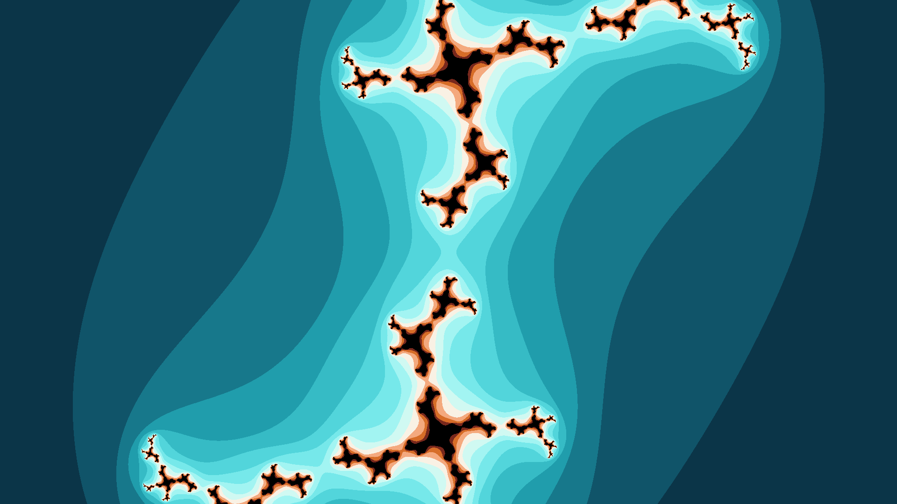
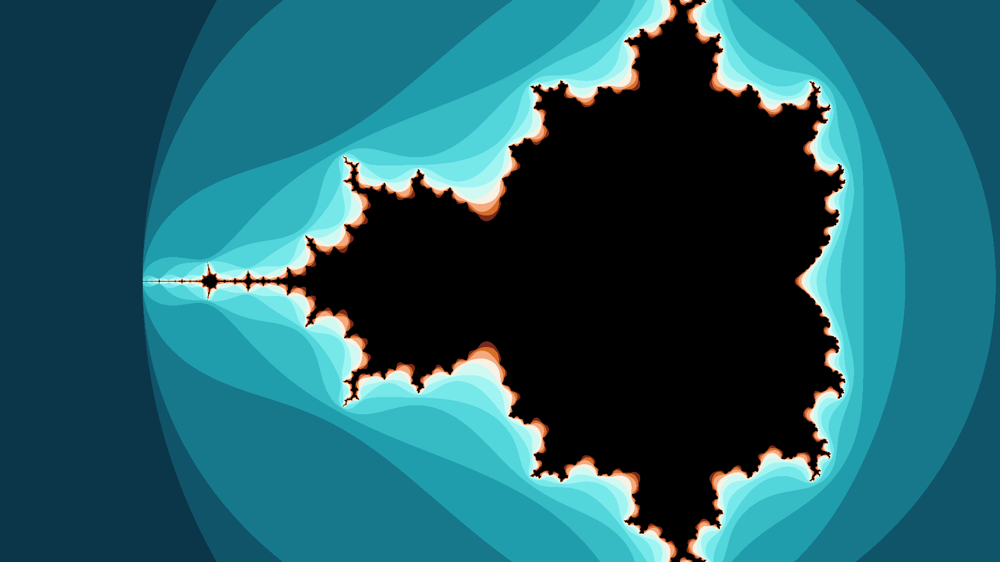
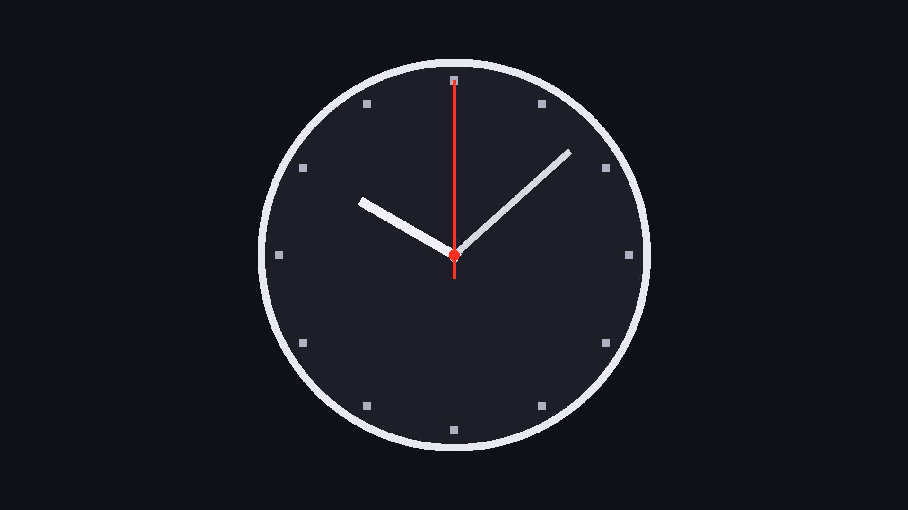
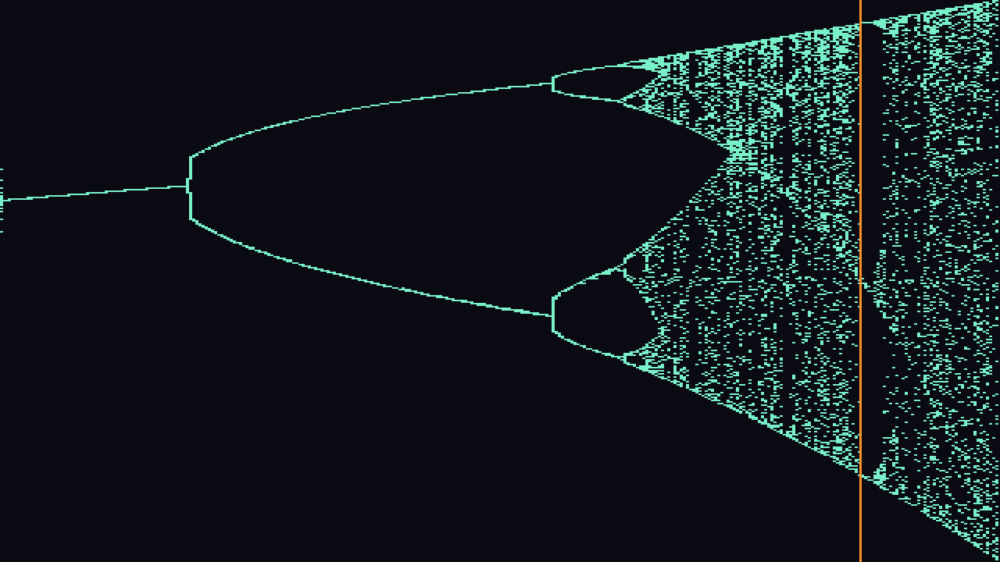
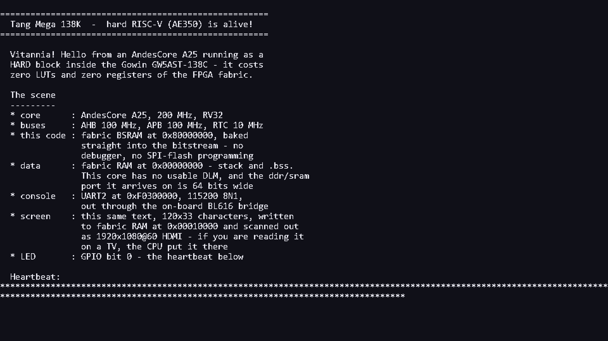

# Tang Mega 138K - FPGA projects

Self-contained FPGA projects for the **Sipeed Tang Mega 138K**
(Gowin **GW5AST-138C**). Six of them put a picture on HDMI with **no
framebuffer** - four generate it in fabric, one wakes up the **hard RISC-V CPU**
hiding in the same die and lets it print to the screen, and one **composes
music** and draws the map it is composing from. The seventh has no picture at
all: it gives that same hard CPU a full **LiteX SoC** with **1 GiB of DDR3**.

All of it was built with the **free Education edition** of Gowin EDA -
including the hard RISC-V, and including DDR3.

## Video projects

Every pixel is computed on the fly at the 150 MHz pixel clock as the raster
scans - there is **no framebuffer** and no external memory.

| Preview | Project | What it shows |
|---|---|---|
|  | **[fractal_art](fractal_art/)** | Generative, ever-changing fractal art - a Julia set that wanders and recolours forever |
|  | **[fractal_anim](fractal_anim/)** | Animated Julia set that morphs smoothly between shapes |
|  | **[mandelbrot](mandelbrot/)** | The classic Mandelbrot set, rendered live |
|  | **[analog_clock](analog_clock/)** | Analog clock with moving hour / minute / second hands |

- **The three fractal projects** share one proven **escape-time pipeline**
  (`z <- z^2 + c`, evaluated once per pixel): the iteration loop is fully
  unrolled into a deep pipeline in **Q4.14** fixed point, so a new pixel enters
  and a finished pixel leaves every clock. `mandelbrot` sweeps `c` across the
  screen; `fractal_anim` and `fractal_art` fix the view and walk `c` over time.
- **The clock** avoids per-pixel multiplies entirely: the hand / ring / tick
  tests are affine or quadratic in the screen coordinates, so they are tracked
  with **adders only (a DDA)** and a few per-frame lookup tables.
- **`tools/`** holds a bit-exact **Python model** that both validates the
  fixed-point math and generates the Verilog colour / angle LUTs and the
  reference renders in `docs/`.

All four close timing at the **150 MHz** pixel clock.

## Sound

| Preview | Project | What it does |
|---|---|---|
|  | **[fractal_music](fractal_music/)** | A logistic map composes; the trajectory of that same map fills the screen with a playhead riding along it |

The only project here with audio, out through the board's **PT8211** DAC - a
16-bit R-2R ladder with no master clock and no registers, driven in
LSB-justified format. Nothing scripts the music: `x <- r*x*(1-x)` is stepped
while `r` sweeps from 2.8 to 4.0 over forty seconds, and the shape of the piece
is the shape of the map. Below the first bifurcation one note repeats; past it
a two-note figure appears, then four, then chaos, with windows of clear motif
inside it. Eight voices are time-multiplexed onto one wavetable, panned from
the orbit itself, and sent through a cross-coupled stereo delay.

The screen deliberately shows the **trajectory** rather than the settled
attractor. Just past `r = 3` the fixed point is only marginally unstable, so an
orbit sitting on it takes thousands of iterations to spiral away - the textbook
diagram forks a full second before the music does. Plotting what the orbit
actually visits makes picture and sound agree by construction.

This one runs at **1280x720**; sharing the die with the audio engine cost
enough routing margin that 1080p would not close.
[Listen to the rendered preview](fractal_music/docs/preview.wav).

## Hard RISC-V

| Preview | Project | What it does |
|---|---|---|
|  | **[riscv_hdmi](riscv_hdmi/)** | Runs C on the **AndesCore A25** hardened into the GW5AST-138C, printing to a 1080p text console |

The GW5AST-138C is not just an FPGA: it carries an **A25 + AE350 subsystem as
hardened silicon**, so the CPU costs *zero LUTs and zero registers*. This
project boots it from a fabric ROM baked into the bitstream - no debugger, no
SPI-flash programming - gives it fabric RAM for its stack, and has it print a
greeting to two places at once: the serial console, and a **120x33 character
screen** the fabric scans out at 1920x1080. The CPU writes characters into a
dual-ported buffer; a glyph ROM and a five-stage pipeline turn them into
pixels as the raster passes.

Gowin's IP Core Generator has no AE350 entry in the **Education** edition,
which makes the core look unavailable. It is not: `AE350_SOC` is in the device
primitive library and can be instantiated by hand. Doing so means meeting a few
requirements the generator would otherwise handle silently - the core clock
arrives over a *dedicated path* from one specific PLL output, the internal DLM
does not exist on this part, and the data port is 64 bits wide. The project
README documents each one, along with the LED-only bisection programs used to
find them.

## A full SoC on that same CPU

| Project | What it does |
|---|---|
| **[litex_ae350](litex_ae350/)** | A **LiteX SoC** on the hard A25 with **1 GiB of DDR3** and the LiteX BIOS on a serial console |

Where `riscv_hdmi` drives the hard core by hand, this hands it to **LiteX**: a
generated SoC with a real BIOS, an interactive console, and the board's DDR3
underneath it. No `.gprj` - LiteX writes the Verilog, the constraints and the
Tcl and drives `gw_sh` itself. What the directory holds is six patches against
upstream LiteX and the scripts to build with them.

DDR3 goes through **Gowin's own controller** rather than litedram's Gowin PHY,
whose read calibration never converged here. That is not a workaround so much as
the same choice the vendor made: the `RiscV_AE350_SOC` IP has no DDR3
controller of its own and compiles this very core into its generated wrapper. It
also runs the PHY at a 1:4 clock ratio where litedram's runs 1:2, which is what
puts the board's **full 32-bit bus** - both devices, 1 GiB rather than 512 MiB -
at DDR3-800.

The controller stayed silent for a long time over a **circular start-up
dependency** that is easy to build and hard to see: `pll_stop` is an IP *output*
that gates the memory clock and only rises once the IP leaves reset, so gating
the PLL's only enabled output with it, while releasing reset on PLL lock, leaves
nothing to break the circle. The README works through that and the rest -
including two attempts at faster reads that were measured, rejected and written
down rather than quietly dropped.

**The vendor's DDR3 netlist is not redistributed here**; the README says where
to get it and it is passed in by path.

## Hardware

- **Board:** Sipeed Tang Mega 138K
- **FPGA:** Gowin GW5AST-138C (`GW5AST-LV138PG484AC1/I0`, `gw5ast138c-007`)
- **Video clocking:** on-chip PLL, VCO 750 MHz -> 150 MHz pixel + 750 MHz serial (5x)
- **Video output:** 1920x1080, 150 MHz pixel clock (~60.6 Hz refresh), raw
  **DVI** TMDS (no InfoFrame / HDCP). Connect the HDMI cable **directly to a TV
  or monitor** - some AV receivers reject a raw-DVI stream. `fractal_music`
  runs 1280x720 off a 75 MHz pixel clock instead.
- **Audio** (fractal_music): **PT8211** DAC on the 3.5 mm jack - `HP_BCK` Y17,
  `HP_WS` AB17, `HP_DIN` AA16, `PA_EN` AB16 (**active low**, drive 0 to enable).
  Not over HDMI: real HDMI audio needs data islands and TERC4, which a raw-DVI
  transmitter does not do.
- **DDR3** (litex_ae350): two x16 devices sharing one address/command bus, so
  the memory is **32 bits wide and 1 GiB** in total. Driven at DDR3-800 off a
  400 MHz memory clock, from a **second PLL pinned to `PLL_L[0]`** - the left
  side, next to the memory banks, while the CPU's PLL has to sit at `PLL_R[0]`.
- **Serial console** (riscv_hdmi, litex_ae350): through the on-board **BL616**
  USB-serial bridge at 115200 8N1; if two COM ports appear, it is usually the
  higher-numbered one.
- **On-board LEDs:** `T18`, `R18`, `R17`, `P16` - **active low**. Note `V13`
  has no LED fitted on this board and `U21` is a dedicated CPU/SSPI pin.

## Build

1. Install **Gowin EDA V1.9.11.03** (Education is fine - everything here,
   including the hard RISC-V, was built with it).
2. Open `<project>/eda_proj/<project>.gprj`.
3. Set the top module to `top`, then **Synthesize -> Place & Route -> Program**.

The bitstream lands in `<project>/eda_proj/impl/pnr/<project>.fs`
(the `impl/` build output is git-ignored).

For `riscv_hdmi` the firmware is compiled into the bitstream, so build it
**first** (`fw/build.ps1`, xPack `riscv-none-elf-gcc`) whenever the C changes.

`litex_ae350` does not follow this flow at all - there is no `.gprj` to open,
because LiteX generates the whole project and drives `gw_sh` itself. It needs a
patched LiteX checkout and, for DDR3, two files from Gowin's IP that are not
redistributed here. See [its README](litex_ae350/).
