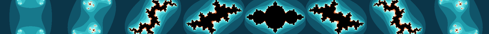

# Animated Julia fractal on HDMI (Tang Mega 138K)

A continuously **morphing Julia-set** fractal rendered to **1920x1080 @ 60 Hz**
HDMI on the Sipeed Tang Mega 138K (Gowin GW5AST-138C).



## How it works

Same escape-time iteration `z <- z^2 + c` and the same timing-closed streaming
pipeline as the `mandelbrot` project (per pixel, one pixel per clock, no
framebuffer), but with the two roles swapped and one of them animated:

- **z0 = the pixel's complex coordinate** (view centred on the origin);
- **c = a constant that walks a circle** `c = 0.7885 * (cos t, sin t)`,
  advanced one step (of 256) every `ANIM_DIV` frames, so the Julia set morphs
  through spirals, dendrites and vortices — a full loop every ~8.5 s.

The rest is identical to the Mandelbrot engine: N=14 iterations unrolled into
a 3-stage-per-iteration pipeline (Q4.14 fixed point, 41 DSPs), a DDA for the
pixel -> plane mapping, a 1-LUT escape test, and the "teal & orange" palette.
The animated `c` comes from a 256-entry circle LUT indexed by a per-frame
angle counter (registered so the big table stays off the DSP critical path).

Timing closes at **Fmax ~151 MHz** (target 150).

## Layout

```
eda_proj/                 Gowin project (open fractal_anim.gprj in the IDE)
  src/top.v               PLL + reset + DVI-TX + julia_gen
  src/video-misc/julia_gen.v   the animated fractal engine
  src/dvi-tx/, gowin_pll/, video_timing_ctrl.v   reused HDMI infrastructure
tools/julia_model.py      bit-exact software model: renders preview frames and
                          generates the Verilog c-circle + palette LUTs
docs/                     rendered reference frames
```

## Regenerating LUTs / previews

`tools/julia_model.py` reproduces the exact hardware fixed-point maths, so its
renders match the board output:

```
python tools/julia_model.py
```

Then paste `tools/c_lut.vh` and `tools/palette_lut.vh` into `julia_gen.v`
(keep `N` and the view constants in sync).

## Build

Open `eda_proj/fractal_anim.gprj` in Gowin EDA (V1.9.11.03), set the top module
to `top`, Synthesize -> Place & Route -> Program. Connect the board's HDMI port
**directly to a TV/monitor** (raw DVI, no InfoFrame/HDCP; AV receivers may
reject it). Tune the morph speed with the `ANIM_DIV` parameter of `julia_gen`.
