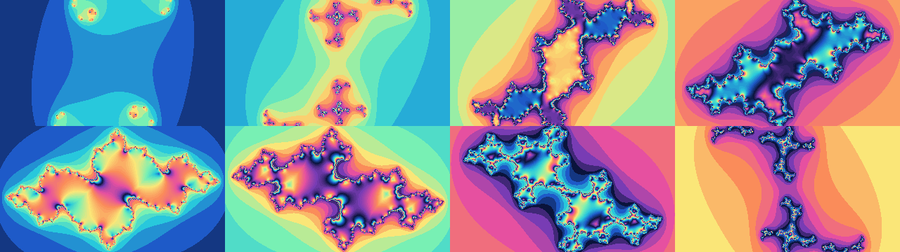

# Generative fractal art on HDMI (Tang Mega 138K)

Ever-changing, never-repeating **fractal art** on **1920x1080 @ 60 Hz** HDMI
(Sipeed Tang Mega 138K, Gowin GW5AST-138C): a Julia set whose shape wanders
pseudo-randomly while a jewel-tone palette rotates through it.



## How it works

The same escape-time engine as the `mandelbrot` / `fractal_anim` projects
(z <- z^2 + c per pixel, one pixel per clock, no framebuffer), driven so it
generates fresh structure and colour forever:

- **random structure** - `c` walks the circle `c = 0.7885*(cos t, sin t)`
  (near the Mandelbrot boundary, so the Julia set is always intricate). The
  angle advances every frame at an **LFSR-driven speed that never reaches
  zero**: the magnitude wanders in a fixed band and the direction reverses
  only occasionally, so the morph is *continuous* (never freezes) yet never
  repeats. The radius is baked into a 256-entry `c` LUT (no runtime multiply).
- **changing colours** - a **cyclic jewel-tone palette** (64 entries, loops
  smoothly) is indexed by `cnt*STRIDE + colour_offset`; the offset advances
  every few frames, so hues flow through the structure.
- **no black hole** - interior (in-set) pixels are shaded by the final orbit
  magnitude `|zr|+|zi|` instead of black, so the middle reads as a glowing,
  structured fill rather than a void.

Engine: N=12 iterations unrolled into a 3-stage-per-iteration pipeline
(Q4.14), 1-LUT escape test. The `c`-circle and palette LUTs are registered
so their big muxes stay off the DSP critical path.
Timing closes at **Fmax ~150 MHz** (target 150).

## Layout

```
eda_proj/                 Gowin project (open fractal_art.gprj in the IDE)
  src/top.v               PLL + reset + DVI-TX + random_fractal_gen
  src/video-misc/random_fractal_gen.v   the generative-art engine
  src/dvi-tx/, gowin_pll/, video_timing_ctrl.v   reused HDMI infrastructure
tools/art_model.py        bit-exact model: renders showcase frames and emits
                          the c-circle (c_lut.vh) + palette (pal_lut.vh) LUTs
docs/                     rendered reference frames
```

## Tuning

Parameters on `random_fractal_gen`: `COLOR_DIV` (colour-cycle speed),
`STRIDE` (hue spread per band), `N` (iteration depth / detail). The `c`
radius (0.7885) lives in `tools/art_model.py` (`R_FIX`); re-run
`python tools/art_model.py` to re-render previews / regenerate LUTs.

## Build

Open `eda_proj/fractal_art.gprj` in Gowin EDA (V1.9.11.03), set the top module
to `top`, Synthesize -> Place & Route -> Program. Connect HDMI **directly to a
TV/monitor** (raw DVI, no InfoFrame/HDCP; AV receivers may reject it).
