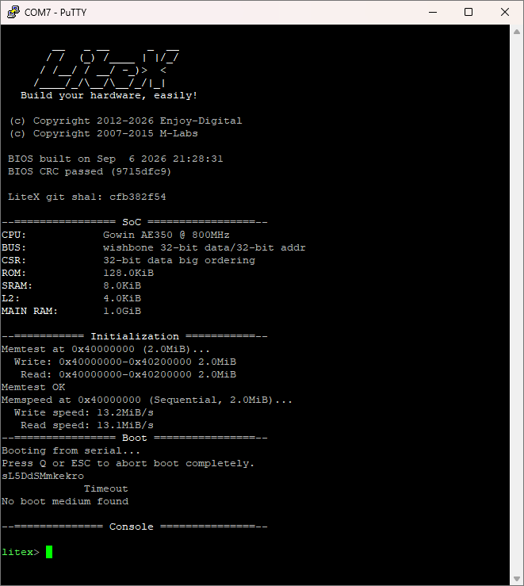

# LiteX SoC on the hard AE350 (Tang Mega 138K)

A **LiteX SoC built around the hardened AndesCore A25** that lives in the
GW5AST-138C die, with **1 GiB of DDR3** behind it and the LiteX BIOS on an
interactive serial console. The CPU costs zero LUTs and zero registers — it is
already in the silicon — and all of it, DDR3 included, builds with the **free
Education edition** of Gowin.

```
CPU:      Gowin AE350 @ 800MHz
ROM:      128.0KiB
SRAM:     8.0KiB
L2:       4.0KiB
MAIN RAM: 1.0GiB
Memtest at 0x40000000 (2.0MiB)...
Memtest OK
litex>
```



Boot logs: [docs/console-ddr3.txt](docs/console-ddr3.txt) with DDR3,
[docs/console.txt](docs/console.txt) for the block-RAM configuration.

**This is not a Gowin project — there is no `.gprj` here.** LiteX generates the
Verilog, the constraints and the Tcl, and drives `gw_sh` itself. What this
directory holds is everything needed to reproduce that: six patches against
upstream LiteX, and the scripts for a split build.

## What you need

| | |
|---|---|
| Gowin EDA | V1.9.11.03, **Education is enough** |
| LiteX | a `litex_setup.py --init --install` checkout, plus the six patches here |
| RISC-V GCC | xPack `riscv-none-elf-gcc` 15.2.0 — the *same* build on both machines |
| A Linux box | to compile the BIOS (see below); a Raspberry-Pi-class board is plenty |
| DDR3 only: two vendor files | **not included here** — see below |

### The two files this repository cannot ship

`--with-gowin-ddr3` drives Gowin's **DDR3 Memory Interface IP**, which is
delivered as an encrypted, device-specific netlist. That netlist and the
`PLL_INIT` module beside it are Gowin's, not ours, so they are referenced
rather than redistributed:

| File | Where to get it |
|---|---|
| `ddr3_memory_interface.v` | Sipeed's [TangMega-138K-example](https://github.com/sipeed/TangMega-138K-example), `ddr_memory/ddr_memory_test_uart/src/ddr3_memory_interface/` |
| `pll_init.v` | the same example, `ddr_memory/ddr_memory_test_uart/src/` |

Both are passed in by path (`--gowin-ddr3-netlist`, `--gowin-pll-init`), so any
generated copy will do — but the netlist is built for **one exact device**, and
the one above is built for this board's `GW5AST-LV138PG484AC1/I0`. Generating a
*different* configuration needs a licensed Gowin edition; using this one does
not.

## Why the build is split across two machines

The Gowin toolchain here is Windows-only, and the LiteX BIOS wants `make` and
a POSIX shell. So the gateware is built on the PC and the BIOS on a Linux box
(an OrangePi 5 Ultra), then combined.

This works because the two sides agree exactly — same LiteX commit, same xPack
GCC 15.2.0, same Meson — and the generated `csr.h` / `mem.h` differ only in
their timestamp comments. `BIOS CRC passed` at boot is the proof.

```
Linux:    --build --no-compile-gateware        -> software/bios/bios.bin
PC:       --build --no-compile-software --integrated-rom-init <bios.bin>
```

**`--no-compile-software` alone is not enough.** In `builder.py`, `use_bios`
gates both the BIOS compile *and* `_initialize_rom_software()`, so the ROM
comes out empty with no complaint. `--integrated-rom-init` is the lever that
actually loads it — check that `gateware/*_rom.init` has (bios size / 4) lines
before believing a build.

## Patches

Apply to a `litex_setup.py --init --install` checkout, then keep both machines
in step with `scripts/sync_to_opi.ps1`.

| Patch | What it fixes |
|---|---|
| `01-gw5a-vco-range` | `GW5APLL` assumed a VCO range of 800–2000 MHz; the toolchain enforces **650–1300** on GW5AST. The solver happily chose VCO = 1600 MHz for a 50 MHz sys / 800 MHz cpu pair when the legal VCO = 800 solution gives identical outputs. `PA1019` is only a *warning*, so a bitstream is written whose PLL never locks — a dead board with a clean log. **Required for the working configuration.** |
| `02-gowin-additional-sdc` | The Gowin backend had no way to emit `set_false_path` at all — `add_false_path_constraint()` on that platform is a no-op. Adds `additional_sdc_commands`, mirroring the existing `additional_cst_commands`. |
| `03-gw5a-pll-enable-and-init` | Two things `GW5APLL` cannot express that **any** Gowin memory controller needs: a per-output clock enable (`ENCLK`n was hard-wired to 1) and the `PLL_INIT` startup sequencer that every vendor-generated GW5A PLL is wrapped in. |
| `04-gowin-ddr3-core` | New `litex/soc/cores/ram/gowin_ddr3.py`: Gowin's DDR3 Memory Interface IP wrapped as a LiteDRAM native port. |
| `05-tang-mega-138k-platform` | DDR3 IO attributes: `SSTL15_I`/`SSTL15D_I` are rejected outright (`CT1109`), a group-level `IOStandard` is *appended* to the per-subsignal one rather than overriding it, and `BANK_VCCIO=1.5` collides with the ELVDS buffers `GW5DDRPHY` instantiates. Adds `ddram:1`, the board's **full 32-bit** bus. |
| `06-tang-mega-138k-target` | Both memory paths: the litedram clocking work (`--with-ddr3`, still not converging) and the working `--with-gowin-ddr3`, plus a guard on the CPU's PLL output index (below). |

## The trap that cost the most

`CORE_CLK` reaches the hard CPU over a dedicated path that exists only between
**`PLL_R[0]`'s clkout1** and the core. Being on the right PLL is *not enough* —
it has to be that specific output, and `create_clkout()` hands them out in
creation order.

The upstream target created `cd_sys2x_i` first and `cd_cpu` second, so the CPU
got clkout1 by luck. Moving the memory clock to its own PLL freed clkout0, the
CPU slid into it, and the core stopped receiving a clock entirely: no banner,
no console, no LED, and a build reporting no errors whatsoever.

Patch `06-tang-mega-138k-target` therefore occupies clkout0 deliberately and
asserts the index, so the mistake fails the build instead of the board:

```python
cpu_clkout = pll.nclkouts
pll.create_clkout(self.cd_cpu, cpu_clk_freq, with_reset=False)
assert cpu_clkout == 1, "AE350 CORE_CLK must come from PLL_R[0] clkout1 ..."
```

## Build

Block RAM only:

```powershell
scripts\build_tangmega.ps1 --build --integrated-main-ram-size 0x40000
scripts\build_tangmega.ps1 --load
```

With 1 GiB of DDR3, pointing at the two vendor files from *What you need*:

```powershell
$ip = "<TangMega-138K-example>\ddr_memory\ddr_memory_test_uart\src"
scripts\build_tangmega.ps1 --build --with-gowin-ddr3 `
    --gowin-ddr3-netlist "$ip\ddr3_memory_interface\ddr3_memory_interface.v" `
    --gowin-pll-init     "$ip\pll_init.v"
```

The toolchain and checkout locations are script parameters, so nothing here
assumes the author's drive letters:

```powershell
scripts\build_tangmega.ps1 -Gowin D:\Gowin\... -WorkDir D:\litex\soc --build
scripts\sync_to_opi.ps1    -LitexRoot D:\litex -Remote pi@buildhost.local
```

Adding `--integrated-main-ram-size 0x40000` to that keeps main RAM in block RAM
and maps DDR3 separately at `0x6000_0000`. That is the configuration to debug
in: if the controller does not train, every access to main RAM costs a full bus
timeout and the BIOS memtest never finishes, so the console never appears and
the `ddr3_init` CSR that would tell you why cannot be read.

The script prepends `gw_sh`, the RISC-V toolchain and the pip-installed
`meson`/`ninja` to `PATH`, and — importantly — runs from a subdirectory. A
folder named `litex` beside the interpreter's CWD shadows the installed package
as an empty namespace package, and the error is unrecognisable:
`ImportError: cannot import name 'get_data_mod' from 'litex' (unknown location)`.

Serial console on the on-board BL616 bridge at 115200 8N1 (`U15`/`V14`). If two
COM ports appear it is usually the higher-numbered one.

## Sharing memory with the fabric

Block RAM is genuinely dual-ported, so a second port via migen's
`Memory.get_port()` gives fabric logic its own access to the same 256 KiB the
CPU sees at `0x4000_0000` — no arbiter, no latency. For control and status use
CSRs; for bulk streaming use `WishboneDMAReader`/`WishboneDMAWriter` as bus
masters.

Coherency is free here: the A25's caches come out of reset disabled and neither
`crt0.S` nor the BIOS turns them on, so every CPU access reaches memory. Note
that `flush_cpu_dcache()` in LiteX's `gowin_ae350` port is an **empty stub**
marked FIXME — if the D-cache is ever enabled, there is no software lever to
flush it.

## DDR3: 1 GiB, through Gowin's own controller

```
MAIN RAM:       1.0GiB
Memtest at 0x40000000 (2.0MiB)...
Memtest OK
```

`--with-gowin-ddr3` replaces litedram's `GW5DDRPHY` with the **Gowin DDR3
Memory Interface IP**, wrapped as a LiteDRAM native port by
`litex/soc/cores/ram/gowin_ddr3.py`. That buys the full 32-bit bus — both
devices, **1 GiB** rather than 512 MiB — at DDR3-800 off a 400 MHz memory
clock, because the vendor PHY runs 1:4 where `GW5DDRPHY` runs 1:2.

This is not an exotic choice. **The AE350 has no DDR3 controller of its own**:
`RiscV_AE350_SOC`'s generated wrapper compiles `ddr3_1_4code_hs.v` and
`DDR3_TOP.v` — this same core — beside an arbiter and two clock-crossing FIFOs.
Gowin's manual even documents changing its configuration by dropping the
standalone IP's `gwmc_param.v` into `ipcore/RiscV_AE350_SOC/data/
ddr3_custom_settings`. Doing it in LiteX is the same thing by hand.

The netlist is encrypted and device-specific, so nothing here generates it —
pass an existing one with `--gowin-ddr3-netlist`. **It builds under the
Education edition**; only *generating* a new configuration needs a licence.

### What actually broke it: a circular start-up dependency

For a long time `init_calib_complete` simply stayed low. The cause was not the
memory, the pins or the timings — a port-by-port, pin-by-pin and
parameter-by-parameter diff against Sipeed's working `ddr_memory_test_uart`
found 0 mismatches among 40 IP ports and 66 pins. It was the clock enable:

```
no lock -> no rst_n -> IP held in reset -> pll_stop = 0
        -> memory clock gated off -> no lock
```

`pll_stop` is an IP output that gates the memory clock, and it only rises once
the IP leaves reset. We released reset on PLL lock and let `pll_stop` gate
`CLKOUT0` — the PLL's *only* enabled output. Nothing could break the circle.

Sipeed gate `CLKOUT2` and leave `CLKOUT0`/`CLKOUT1` free-running, and their
`rst_n` comes from a debounced button that knows nothing about the PLL. The fix
reproduces both. The PLL configuration is now identical to the vendor's:
`MDIV=16`, `ODIV0=2 / ODIV1=16 / ODIV2=2`, `ENCLK0=1, ENCLK1=1,
ENCLK2=pll_stop`.

Two smaller differences found by the same comparison and also fixed:
`PULL_MODE=NONE` on every DDR3 pin (Gowin defaults to a pull-up, which has no
business on SSTL15 with ODT), and `PLL_INIT`, the startup sequencer that tunes
the charge pump and loop filter and gates `lock` — LiteX had no equivalent and
was handing the controller the PLL's raw `LOCK`.

### Throughput

A 4 KiB L2 cache sits in front of the controller — `wishbone.Cache`, the same
block `add_sdram()` gives every litedram SoC and the one thing this hand-rolled
path was missing. Its slave side is the port's full 256 bits, so one miss
fetches a whole 32-byte line and the next seven words are hits.

4 KiB rather than LiteX's usual 8: at 8 KiB `sys_clk` comes out at 49.2 MHz
against a 50 MHz constraint with 21 violated endpoints, and it measures exactly
the same. At 4 KiB timing closes clean — TNS 0.000 on every domain.

| | Without L2 | With L2 |
|---|---|---|
| Read | 5.8 MiB/s | **13.1 MiB/s** |
| Write | 15.2 MiB/s | 13.2 MiB/s |

Reads are 2.3× faster; writes lose a little because they now go through the
same write-back cache. That is 14.6 sys cycles per 32-bit word, down from 33 —
so the DRAM round trip was about 18 of those cycles and is now gone. What is
left is per-word CPU, interconnect and cache-lookup overhead, and it is the
same path the timing report calls critical (`dbus_adr` → bus decoder, logic
depth 10). Going faster from here means the CPU side — its caches come out of
reset disabled — not the memory.

Two routes to the same goal were tried and rejected, both recorded here so
nobody spends the time again:

**Persisting the upconverter's own line cache.** `LiteDRAMWishbone2Native`'s
upconverter already keeps a 32-byte line, but retires it on `wishbone_last`,
which is `cti != CTI_BURST_INCREMENTING` — and `AHB2Wishbone` never emits a
burst CTI. So the flag is always set, the line is dropped the instant it is
fetched, and **on any AHB CPU that cache never activates at all**. Worth
reporting upstream. Keeping the line across Wishbone cycles simulates correctly
(bridge and CDC together, one DRAM read per eight words, every lane right) and
reached 14.0 MiB/s on the board — while reproducibly corrupting memory: exactly
seven words in eight wrong, bit-identical across two builds. Not understood; not
shipped. Timing was ruled out (TNS 0.000 everywhere, and the *working* build has
a violation this one does not) and so was marginal training (identical failure
across builds, `BANK_VCCIO` changed nothing). The L2 above gets the same effect
through a supported route.

**Running sys on the controller's clock.** `clk_out` is 100 MHz, so putting the
SoC on it would remove both clock crossings and double the bus clock at once.
It builds, and it does not fit: Fmax 71.8 MHz with 752 violated endpoints, every
worst path starting at the AE350's dbus address register and running through the
bus decoder. At 50 MHz that same path leaves only 11% margin, so 100 MHz needs
the interconnect pipelined, not a constraint change.

### The litedram path, for the record

`--with-ddr3` still selects `GW5DDRPHY`, and its read calibration still does
not converge. Measured, all at 16-bit width:

| Configuration | Read leveling | Memtest data errors |
|---|---|---|
| Upstream, one PLL, 200 MT/s | no window at all | 91.6% |
| **Second PLL on `PLL_L[0]`, 200 MT/s** | **one window, `m1 b02`** | **50.8%** |
| …plus DLL pinned to `DDRDLLM_BL` | unchanged | 99.999% |
| …at 375 MT/s instead | window lost | 87.5% |
| …plus CLKDIV at `LEFTSIDE[4]` | unchanged | 50.8% |

Every pin was verified against Sipeed's own `ddr_memory/ddr_memory_test_uart`
constraints for this board, and the geometry litedram assumes
(8 banks × 32768 rows × 1024 columns) matches. The clocking recipe from Gowin's
`RiscV_AE350_SOC_V1.3/example/DDR3_Shared` reference for this exact die was
applied in full: two PLLs, `PLL_R[0]` for the CPU and `PLL_L[0]` for the
memory, plus the DLL and clock-divider placements.

Moving the memory clock to the left PLL is a real, measurable improvement —
from nothing at all to nearly half of memtest reading back correctly. But byte
lane 0 never finds a valid strobe delay in any configuration, and the remaining
knobs are guesses about `GW5DDRPHY`'s internals rather than anything the board
determines. Note also that the vendor controller uses a 1:4 clocking ratio
where `GW5DDRPHY` uses 1:2, so the same 50 MHz controller clock gives Gowin
400 MT/s and litedram only 200.

All three litex-boards targets carrying this PHY default to a clock at which
DDR3 cannot work, which suggests the support is unfinished rather than
board-specific. The evidence above is written up for upstream.

Since the vendor IP now works, this path is kept only as evidence; there is no
reason to prefer it on this board.
