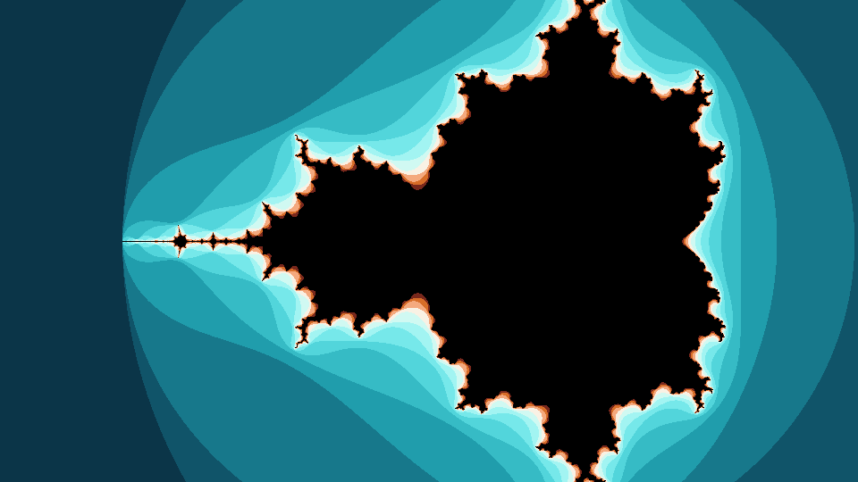

# Mandelbrot set on HDMI (Tang Mega 138K)

Real-time Mandelbrot-set fractal rendered to **1920x1080 @ 60 Hz** HDMI
on the Sipeed Tang Mega 138K (Gowin GW5AST-138C).



## How it works

The escape-time iteration `z <- z^2 + c` (z0 = 0) is evaluated **per pixel,
one pixel per clock**, by a fully-unrolled streaming pipeline — so it feeds
the 150 MHz video stream directly, with **no framebuffer**.

- `N = 14` iterations are unrolled; each iteration is 3 pipeline stages
  (products / combine / update+escape) so no two DSPs are chained
  combinationally.
- Fixed point is **Q4.14** (signed 18-bit); each product is one 18x18 DSP
  (38 DSPs total).
- Pixel -> complex plane is a DDA (adders only): `cr` steps per pixel, `ci`
  per line. View window: real `[-2.5, +1.0]`, square pixels.
- The escape test `|z|^2 > 4` is a 1-LUT check (`|mag[35:30]`), and the
  iteration count maps to colour through a "teal & orange" palette LUT.
- Reuses the proven DVI-TX + PLL (150/750 MHz) + video timing from the
  `hdmi_colorbar` project.

Timing closes at **Fmax ~155 MHz** (target 150).

## Layout

```
eda_proj/                 Gowin project (open mandelbrot.gprj in the IDE)
  src/top.v               PLL + reset + DVI-TX + mandelbrot_gen
  src/video-misc/mandelbrot_gen.v   the fractal engine
  src/dvi-tx/, gowin_pll/, video_timing_ctrl.v   reused HDMI infrastructure
tools/mandelbrot_model.py bit-exact software model: renders previews and
                          generates the Verilog palette LUT (tools/palette_lut.vh)
docs/                     rendered reference images
```

## Regenerating the palette / previews

`tools/mandelbrot_model.py` reproduces the exact hardware fixed-point maths,
so its renders match the board output. Run it to re-render the previews and
re-emit the palette LUT:

```
python tools/mandelbrot_model.py
```

Then paste `tools/palette_lut.vh` into the `palette` function of
`src/video-misc/mandelbrot_gen.v` (and keep `N` in sync).

## Build

Open `eda_proj/mandelbrot.gprj` in Gowin EDA (V1.9.11.03), set the top
module to `top`, and run Synthesize -> Place & Route -> Program. Connect the
board's HDMI port **directly to a TV/monitor** (this is a raw DVI signal with
no InfoFrame/HDCP; AV receivers may reject it).
