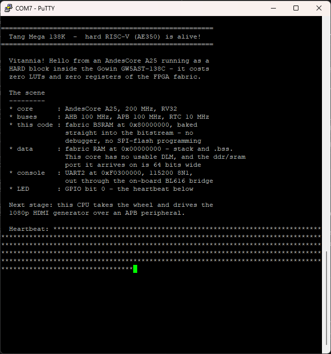

# Hard RISC-V (AE350) on the Tang Mega 138K

The GW5AST-138C does not just host a *soft* CPU - it carries an **AndesCore
A25 + AE350 subsystem as hardened silicon**. This project wakes that core up
and runs C code on it.

**Stage 1 (working):** the core boots from a fabric ROM baked into the
bitstream, keeps its stack in fabric RAM, prints a greeting on UART2 and
blinks an LED as a heartbeat.
**Stage 2:** an APB peripheral so the CPU drives the 1080p HDMI generator.



```
AE350_SOC   | 1/1        | 100%     <- the hard core
Logic       | 148/138240 | <1%      <- reset, diagnostics, two AHB memories
Register    | 139/139095 | <1%
BSRAM       | 17/340     | 5%       <- 16 KB boot ROM + 32 KB data RAM
```

The CPU itself costs **zero LUTs and zero registers**: it is already in the die.

## What was surprising

The Gowin IP Core Generator has no AE350 entry in the **Education** edition,
which makes it look unsupported. It is not - the core is in the device
primitive library (`IDE/data/hardware_core/gw5at/prim_syn.v`, `module
AE350_SOC`) and can be instantiated directly, and everything here was built
with Education. Comparing later against the licensed edition's
`RiscV_AE350_SOC` IP confirmed the wiring below matches what the generator
produces: its `gw_itcm.v`/`gw_dtcm.v` are simply fabric BSRAMs on the same
`ROM_H*`/`DDR_H*` ports, i.e. "ITCM" is Gowin's own memory on the instruction
port and "Customized" is that same port handed to the user.

Also note the simulation model is an **empty stub**, so the CPU cannot be
simulated. Bring-up is "build, flash, watch" - which is why the firmware
blinks an LED before it touches any peripheral.

### Four things that each make the core look completely dead

Every one of these produced identical symptoms - no output, no LED, nothing -
so they had to be separated one at a time on hardware.

1. **`CORE_CLK` is a dedicated path, not fabric routing.** It exists only
   between `PLL_R[0]`'s **`clkout1`** and the core (Gowin MUG1030 §2.6.4), so
   the PLL must be pinned there and that output used. Anything else and the
   CPU has no clock at all:
   ```
   INS_LOC "pll0/PLL_inst" PLL_R[0];
   ```
2. **`WAKEUP_IN` is active low** ("0 is wake up" in the primitive header).
   Tied high, it permanently asks the core to stay asleep.
3. **There is no DLM.** The core-internal DLM at `0xA020_0000` is absent in
   this configuration - CSR `0x7C1` exists, the memory does not (verified by
   store/readback). Data lives in fabric BSRAM instead. The port it arrives on
   is **64 bits wide**, which is easy to miss.
4. **Unused slave ports must be tied ready.** A floating `HREADY`/`PREADY`
   synthesizes to 0 = "not ready", so one stray access hangs the bus forever.

A fifth trap was in the firmware, not the hardware: `uart_putc` waited for
THRE in an unbounded loop *before* the first LED blink. That loop is a handful
of instructions, so it sat entirely in the I-cache - a silent UART wedged the
CPU with no bus traffic and no heartbeat, hiding every other symptom. The wait
is bounded now and the LED blinks first.

## How the CPU gets its program

No debugger and no SPI-flash programming. The AE350 maps its instruction
memory at `0x8000_0000`, so `boot_rom.v` answers that port from fabric BSRAM,
preloaded via `$readmemh` from an image generated out of the ELF. The program
travels **inside the bitstream**.

Memory map (Gowin RiscV_AE350_SOC hardware manual, MUG1031):

| Region | Address | Used for |
|---|---|---|
| Instruction memory | `0x8000_0000`–`0x8FFF_FFFF` | `boot_rom.v` - `.text`/`.rodata` |
| Data memory | `0x0000_0000`–`0x7FFF_FFFF` | `data_ram.v` - `.data`/`.bss`/stack |
| DLM (in core) | `0xA020_0000` | **not present** - see above |
| UART2 | `0xF030_0000` | console, 115200 8N1 |
| GPIO | `0xF070_0000` | heartbeat LED |

The reset vector is `0x8000_0000` (SMU *Hart0 Reset Vector Register*, offset
`0x50`, resets to that value), which is why `.text.init` must be the first
thing the linker emits.

`data_ram.v` is a 64-bit AHB-lite slave with eight byte lanes selected from
`HSIZE` and `haddr[2:0]`, so `sb`/`sh`/`sw` all land correctly. It also
bypasses an in-flight write, because AHB overlaps the data phase of a store
with the address phase of the next transfer - and a load right after a store
to the same word is exactly what a stack does all day.

## Clocks

One PLL feeds every AE350 domain from the 50 MHz board oscillator
(VCO = 50/1 x 16 = 800 MHz):

| Domain | Source | Frequency |
|---|---|---|
| `CORE_CLK` | `clkout1` of `PLL_R[0]` | 200 MHz (dedicated path) |
| `AHB_CLK` / `DDR_CLK` | `clkout0` | 100 MHz |
| `APB_CLK` | `clkout2` | 100 MHz (sets the UART baud) |
| `RTC_CLK` | `clkout4` | 10 MHz |

`DDR_CLK` is deliberately the same net as `AHB_CLK` so the fabric data RAM
cannot end up in the wrong clock domain.

### Speed

Both caches come out of reset **disabled** (`mcache_ctl`, CSR `0x7CA`: `IC_EN`
bit 0, `DC_EN` bit 1). With them off every instruction is fetched from fabric
BSRAM over AHB and the core runs roughly 65x slower than the clock suggests.
`start.S` sets `IC_EN`, measured as a **3x** speedup on hardware. `DC_EN` is
left off on purpose: the data cache would also cover the peripheral region.

## Pinout

Verified on this board with `led_test/`, a fabric-only blink probe.

| Signal | Pin | Notes |
|---|---|---|
| `clk` | `V22` | 50 MHz oscillator |
| `uart_tx` | `U15` | to the **BL616** USB-serial bridge, net `BL616_IO28_TX` |
| `uart_rx` | `V14` | from the BL616, net `BL616_IO27_RX` |
| `led[0..3]` | `T18`, `R18`, `R17`, `P16` | **active low** |
| `key_n` | `F4` | unused - see below |

Two pins to avoid: **`V13` has no LED fitted** on this board (it belongs to the
Console Dock, a different carrier), and **`U21`** - the fifth `state_led` in
Sipeed's own constraint file - is rejected by the placer as a dedicated
CPU/SSPI pin.

`key_n` is deliberately left out of the reset path: if that pin is not the
button it is assumed to be, or simply reads low, it would pin the core in
reset forever and look exactly like a dead CPU.

The four LEDs report how far the boot chain gets:

| LED | Meaning |
|---|---|
| `T18` | fabric heartbeat - fast = clocks and reset OK, slow = not |
| `R18` | the firmware's own GPIO heartbeat |
| `R17` | at least one instruction fetched (latched) |
| `P16` | the data memory was accessed (latched) |

## Layout

```
eda_proj/                 Gowin project (open riscv_hdmi.gprj)
  src/top.v               PLL + reset + AE350_SOC + memories + diagnostics
  src/boot_rom.v          AHB-lite ROM, $readmemh from boot_rom.vh
  src/data_ram.v          64-bit AHB-lite RAM: stack, .data, .bss
  src/gowin_pll_ae350/    PLL retuned for the AE350 domains
fw/                       firmware (C + startup)
  main.c                  greeting, scene description, heartbeat
  start.S                 reset entry, enables the I-cache, sets up the stack
  ae350.h                 register map
  ae350.ld                .text in ROM, .data/.bss/stack in the fabric RAM
  build.ps1 / Makefile    build with or without make
  blink.S                 minimal GPIO blink - "does the core execute at all?"
  ramtest.S               store/readback test of the fabric data RAM
  dlmtest.S               the same for the core-internal DLM (it fails)
tools/bin2vh.py           ELF image -> $readmemh ROM contents
```

The three assembly programs are the bisection steps that found the faults
above. They are kept because they are the fastest way back in if any of this
ever regresses: each one reports its result as an LED blink rate and needs no
stack, no UART and no data memory.

## Build

```
powershell -ExecutionPolicy Bypass -File fw\build.ps1
```
then open `eda_proj/riscv_hdmi.gprj` in Gowin EDA (V1.9.11.03), top module
`top`, Synthesize -> Place & Route -> Program. **Re-run the firmware build
before the FPGA build** whenever the C changes - the image is compiled into the
bitstream.

The toolchain is xPack `riscv-none-elf-gcc` (RV32IMAC); adjust `TOOLCHAIN` in
`build.ps1` / `Makefile` if yours lives elsewhere.

## Watching it run

The console goes out through the on-board **BL616** USB-serial bridge
(`BL616_IO28_TX` / `BL616_IO27_RX`). Connect the board's USB-C and open the
serial port at **115200 8N1** - if two ports appear, the console is usually the
higher-numbered one. Expect the banner shown at the top of this page, then a
`*` per heartbeat with the LED on `R18` blinking in step.

If the LED blinks but the text is garbled, the UART divisor is off: the baud is
derived from `APB_HZ` in `fw/ae350.h`, so correct that constant and rebuild.
